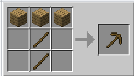
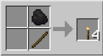
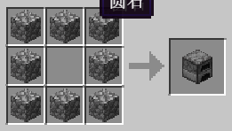

# 新手手册：Minecraft生存入门指南 🌍🎮

## 前言

Minecraft是一款沙盒游戏，玩家将在由方块组成的世界中探索、收集资源并生存。游戏中存在昼夜更替（一天20分钟，现实时间的72倍），夜晚会生成敌对生物。玩家死亡后会在重生点复活（默认出生点，可通过床设置自定义重生点）。本教程将介绍生存模式基础操作、资源收集和初期生存策略。

## 控制和界面 🎮🔑

### 键盘/鼠标默认操作（以Java版为例）

| 操作          | 按键                | 说明                                                            |
| ------------- | ------------------- | --------------------------------------------------------------- |
| 向前移动      | W                   | 🚶‍♂️ 基础移动键                                             |
| 疾跑/游泳     | 双击W 或 按住Ctrl   | 🏃 需饥饿值≥6，水中自动切换为游泳（游泳时显示手臂划水动作）    |
| 向后移动      | S                   | 🚶‍♂️ 后退                                                   |
| 向左/右移动   | A/D                 | 🚶‍♂️ 横向移动                                               |
| 跳跃          | 空格                | 🤸 可跳1.25格高，疾跑时可跃过4格远（按两次空格可连续跳跃）      |
| 潜行          | 左Shift             | 👾 防止坠落、降低被发现概率，水中可下潜（显示身体压低动画）     |
| 切换视角      | F5（笔记本需fn+F5） | 👀 循环切换第一人称/第三人称后视角/第三人称前视角               |
| 攻击/挖掘     | 鼠标左键            | ⛏️ 长按破坏方块，单击攻击生物（挖掘速度与工具类型相关）       |
| 放置方块/交互 | 鼠标右键            | ✅ 使用物品、打开工作台等交互操作（放置方块时显示准星瞄准效果） |
| 打开物品栏    | E                   | 🧰 管理物品、合成道具（支持拖拽排序和快捷拆分）                 |
| 丢弃物品      | Q                   | 🗑️ 可自定义按键避免误触（按住Q可连续丢弃堆叠物品）            |

:::warning ⚠️
基岩版支持触屏操作（显示虚拟按键），部分按键（如自动跳跃）可在设置中调整。
:::

## 简要指导：第一天生存核心 🌞

### 1. 基础资源收集 🌳⛏️

- **破坏原木**：徒手长按原木获取木材，合成4块木板（2×2合成格）。
- **制作工作台**：4块木板围成一圈合成3×3工作台，放置后右键打开高级合成界面 🛠️。
- **制作木工具**：
  - **木镐**：2木棍+3木板，用于挖掘石头（获取圆石） ⛏️。
  - **木斧**：2木棍+3木板，加快伐木速度 🌲。

### 2. 食物与光照 🍖🔥

- **临时食物**：击杀猪、牛、鸡获取生肉（推荐烤制后食用，恢复更多饱食度 🍖→🍖熟），或采集苹果、甜浆果（注意甜浆果丛会造成伤害 ❌）。
- **制作火把**：1煤炭/木炭 + 1木棍合成，放置于洞穴、庇护所防止刷怪 🔥（光照等级≥9可阻止刷怪）。

### 3. 安全过夜 🌙

#### 你可能遇到的怪物：

* 骷髅：一个会动的骨头，手持弓箭，对你造成远程伤害，若他射中了僵尸，则他们之间会打架
* 僵尸：一个绿皮的生物，手持武器和护甲随机刷新。
* 苦力怕：一个绿皮生物，没有腿，会发出呲呲的声音，靠近你他会爆炸，怕猫。
* 蜘蛛：在夜晚或者低亮度情况会攻击你。
* 末影人：一个黑高个会瞬移，只要你不看他眼睛（带上南瓜头就没事）他就不会攻击你，怕水。

#### 方案一：制作床跳过夜晚 🛏️

- **材料**：3羊毛 + 3木板（羊毛可通过击杀绵羊或用剪刀获取，线合成羊毛需4线=1羊毛 🐑→✂️→🧵）。
- **使用条件**：夜晚或雷暴天气，周围10格内无敌对生物 🌩️。
- **注意**：床会设置重生点，破坏床将恢复默认重生点 🌟。

#### 方案二：建造临时庇护所 🏠

- **选址**：挖洞（推荐“挖三填一”垂直竖井）或利用天然洞穴，用石头/泥土封闭入口 ⛰️。
- **防御**：避免使用泥土/木头（苦力怕可炸毁 💥），入口用门或栅栏门（栅栏门可阻挡怪物进入但无法阻挡视线 🔒）。

## 关键机制与进阶技巧 🛠️

### 合成系统 🧩

- **物品栏合成**：2×2格子可制作基础物品（如木棍、工作台） 📦。
- **工作台合成**：3×3格子支持高级合成（如熔炉、工具、盔甲） 🏭。
- **配方书**：新手可通过配方书查看合成路径，默认无需“学习”配方，可直接制作 📖。

:::tip 💡
金质工具效率高但耐久低 ⚡，仅建议临时使用；木质工具可作为熔炉燃料 🔥。
:::

### 熔炉与烧炼 🔥

- **合成**：8圆石围成一圈制作熔炉，用于烧制矿石、食物、木炭 🏭。
- **燃料效率**：木炭/煤炭（烧炼8物品）> 木板（1.5物品）> 原木（1物品） 🔥。
- **高炉/烟熏炉**：烧炼速度双倍，分别专精矿石和食物烧制 🏭🔄。

## 黎明与后续规划 🌅

### 度过第一夜后 🌞

- **清理怪物**：黎明时亡灵生物（僵尸、骷髅）会燃烧 🔥，注意躲避未完全烧毁的怪物 💀。
- **扩建家园**：
  - 用石头加固墙壁，添加玻璃窗户 🧱→🏞️。
  - 种植农田（锄头耕地+种子，需邻近水源 🌱→💧）。
  - 制作箱子（8木板合成）存储物品，避免死亡掉落 📦→💀。

### 采矿入门 ⛏️

- **安全挖掘**：
  - 避免垂直下挖，采用“阶梯法”或2×1竖井（预留安全方块 🚧）。
  - 携带火把、梯子、水桶（防坠落和熔岩 🔦→🧰→💧）。
- **目标资源**：
  - 煤炭（地表附近）：制作火把、燃料 🔥。
  - 铁矿石（需石镐，Y=64以下）：合成铁器、盾牌 ⛏️→🛡️。

## 常用警告与提示 ⚠️💡

:::warning ⚠️

- **坠落伤害**：超过4格高度掉落会受伤 📉，水中可缓冲 💦。
- **熔岩危险**：接触熔岩立即损失大量生命 🔥，携带水桶可快速凝固熔岩为黑曜石 💧→🌋。
- **幻翼生成**：连续3晚未睡觉将生成幻翼 🦇，需及时补充睡眠 💤。
  :::

:::tip 💡
基岩版玩家可利用“自动跳跃”功能简化攀爬 🚶‍♂️↑，Java版可通过“鞘翅”实现快速移动（需击败末影龙获取 🦅→🐉）。
:::

通过实践和探索，你将逐步掌握更复杂的生存技巧，建造属于自己的Minecraft世界！ 🌟
